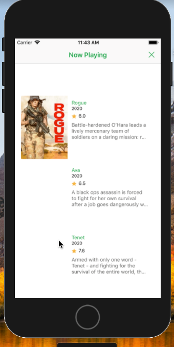

Discover Movies from The Movie DB

###
       | Description   |

 [React Native]   Build Native Mobile Apps using JavaScript and React
 [React Native Navigation] to create more one screen and move between it
 [Redux] Predictable state container for JavaScript apps
 [Redux Thunk] Thunk middleware for Redux 
 [ESLint] The pluggable linting utility for JavaScript and JSX 

## screenshots for android app 

                  IOS Scheenshots

